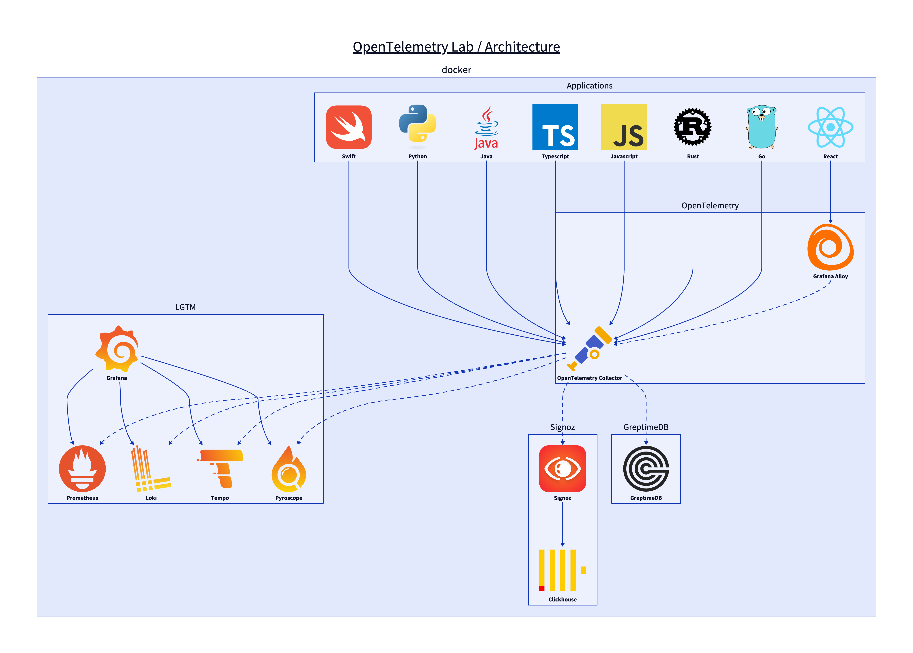

# OpenTelemetry Lab

## Architecture



## Usage

You could choose which Observability stack you want to use:

- [x] lgtm: Loki, Tempo, Prometheus
- [x] clickhouse: Clickhouse, Qryn
- [x] greptimedb: GreptimeDB

```shell
make docker-run CHOICE=xxx
```
