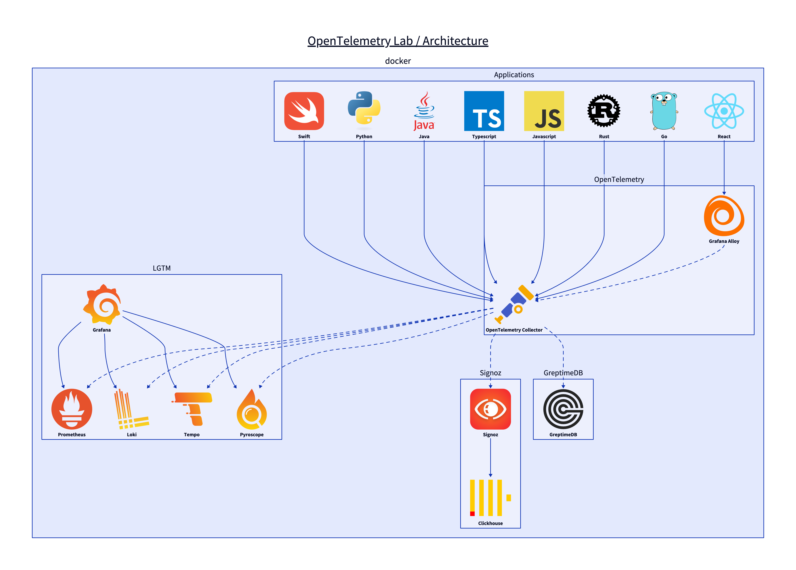

# OpenTelemetry Lab

## Architecture



## OpenTelemetry

| Language   | Logs | Metrics | Traces |
| ---------- | ---- | ------- | ------ |
| Go         | ✅   | ✅      | ✅     |
| Java       | ✅   | ✅      | ✅     |
| JavaScript | ✅   | ✅      | ✅     |
| Python     | ✅   | ✅      | ✅     |
| React      | ✅   |         | ✅     |
| Rust       | ✅   | ✅      | ✅     |
| Swift      | ✅   | ✅      | ✅     |
| TypeScript | ✅   | ✅      | ✅     |

## Usage

You could choose which Observability stack you want to use:

- ✅ lgtm: Prometheus, Loki, Tempo
- ✅ clickhouse: SigNoz with Clickhouse
- ✅ greptimedb: GreptimeDB
- ✅ victoriastack: VictoriaMetrics, VictoriaLogs, VictoriaTraces

Everything lives in a single `compose.yaml` driven by native
[Docker Compose profiles](https://docs.docker.com/compose/how-tos/profiles/).
One profile per backend (`lgtm`, `signoz`, `greptimedb`, `victoriastack`) plus
an `apps` profile for the instrumented applications. Backends are mutually
exclusive — each binds the OTLP ports `4317`/`4318`, so run only one at a time.
The active backend's collector claims the `otel-collector` network alias, so
applications always target `http://otel-collector:4317` regardless of backend.

### Start a backend + applications

```shell
# native docker compose (no make)
docker compose --profile lgtm --profile apps up -d

# or persist the selection in a .env file
echo "COMPOSE_PROFILES=lgtm,apps" > .env
docker compose up -d
```

Swap `lgtm` for `signoz`, `greptimedb`, or `victoriastack` to change backend.

### Everyday commands

```shell
docker compose ps                     # what's running
docker compose logs -f otel-go        # tail one service
docker compose up -d otel-go          # (re)start one service
docker compose down --remove-orphans  # stop everything
```

### Make shortcuts (optional)

```shell
make up CHOICE=lgtm       # backend + apps
make logs SERVICE=otel-go # tail a service
make ps                   # list services
make down                 # stop everything
```

### `docker compose up` vs `make run`

- **`docker compose --profile <backend> --profile apps up -d`** — runs the full
  stack: the shared `opentelemetry-lab` network, the selected backend, the
  OpenTelemetry Collector, and the applications. Containers are detached (`-d`),
  joined to the shared network, and their ports published to the host, so
  endpoints like `http://127.0.0.1:9191/health` are reachable. This is the way
  to actually exercise an application and see its telemetry flow to the
  collector.

- **`make run APP=<app>`** — builds and launches a single application image on
  its own (`docker run --rm`). It does **not** attach the shared network,
  publish any ports, or start the collector. It is only a build-and-boot smoke
  test to confirm the image compiles and the server starts; the app is not
  reachable from the host and has nothing to export telemetry to.

## Port Mapping

### Core Services

| Public Port | Container Port | Service                 | Description                 |
| ----------- | -------------- | ----------------------- | --------------------------- |
| 4317        | 4317           | OpenTelemetry Collector | OTLP gRPC receiver          |
| 4318        | 4318           | OpenTelemetry Collector | OTLP HTTP receiver          |
| 8889        | 8889           | OpenTelemetry Collector | Prometheus metrics exporter |
| 12345       | 12345          | Alloy                   | Grafana Alloy HTTP server   |

### Application Services

| Public Port | Container Port | Service     | Description                               |
| ----------- | -------------- | ----------- | ----------------------------------------- |
| 3001        | 3001           | otel-js     | Node.js application with OpenTelemetry    |
| 3333        | 3333           | otel-ts     | TypeScript application with OpenTelemetry |
| 3434        | 3434           | otel-react  | React frontend application                |
| 8000        | 8000           | otel-python | Python application with OpenTelemetry     |
| 8080        | 8080           | otel-java   | Java application with OpenTelemetry       |
| 8888        | 8888           | otel-go     | Go application with OpenTelemetry         |
| 9999        | 9999           | otel-rust   | Rust application with OpenTelemetry       |

### LGTM Backend (profile: lgtm)

| Public Port | Container Port | Service    | Description                             |
| ----------- | -------------- | ---------- | --------------------------------------- |
| 3000        | 3000           | Grafana    | Web UI for dashboards and visualization |
| 3090        | 9090           | Prometheus | Metrics collection and query API        |
| 3100        | 3100           | Loki       | Logs aggregation and storage            |
| 3417        | 4317           | Tempo      | OTLP gRPC receiver for traces           |
| 3418        | 4318           | Tempo      | OTLP HTTP receiver for traces           |
| 3097        | 9097           | Pyroscope  | Continuous profiling                    |

### GreptimeDB Backend (profile: greptimedb)

| Public Port | Container Port | Service   | Description                     |
| ----------- | -------------- | --------- | ------------------------------- |
| 4379        | 2379           | etcd0     | etcd client port                |
| 4380        | 2380           | etcd0     | etcd peer port                  |
| 4006        | 3000           | metasrv   | GreptimeDB meta server HTTP API |
| 4001        | 3001           | datanode0 | GreptimeDB data node RPC        |
| 4002        | 3002           | metasrv   | GreptimeDB meta server RPC      |
| 4000        | 4000           | frontend0 | GreptimeDB frontend HTTP API    |
| 4001        | 4001           | frontend0 | GreptimeDB frontend RPC         |
| 4002        | 4002           | frontend0 | GreptimeDB MySQL protocol       |
| 4003        | 4003           | frontend0 | GreptimeDB PostgreSQL protocol  |
| 4004        | 4004           | flownode0 | GreptimeDB flow node RPC        |
| 4005        | 4005           | flownode0 | GreptimeDB flow node HTTP API   |
| 4007        | 5000           | datanode0 | GreptimeDB data node HTTP API   |

### SigNoz Backend (profile: signoz)

| Public Port | Container Port | Service    | Description           |
| ----------- | -------------- | ---------- | --------------------- |
| 4317        | 4317           | SigNoz     | OTLP gRPC receiver    |
| 4318        | 4318           | SigNoz     | OTLP HTTP receiver    |
| 5123        | 8123           | ClickHouse | HTTP interface        |
| 5080        | 8080           | SigNoz     | Web UI                |
| 5000        | 9000           | ClickHouse | Native TCP interface  |
| 5181        | 9181           | ClickHouse | Interserver HTTP port |

### Victoria Backend (profile: victoriastack)

| Public Port | Container Port | Service         | Description                             |
| ----------- | -------------- | --------------- | --------------------------------------- |
| 3000        | 3000           | Grafana         | Web UI for dashboards and visualization |
| 8428        | 8428           | VictoriaMetrics | Metrics storage and query API           |
| 9428        | 9428           | VictoriaLogs    | Logs storage and query API              |
| 10428       | 10428          | VictoriaTraces  | Traces storage and query API            |

