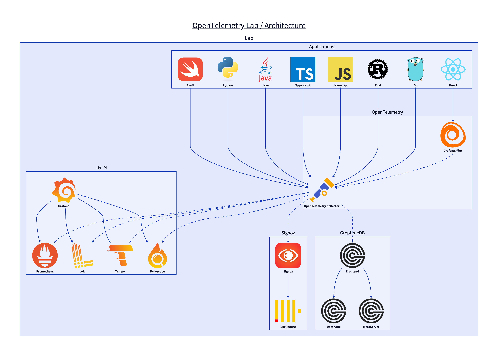

# OpenTelemetry Lab

## Architecture



## OpenTelemetry

| Language   | Logs | Metrics | Traces |
| ---------- | ---- | ------- | ------ |
| Go         | ✅   |         |        |
| Java       |      |         |        |
| Javascript | ✅   |         |        |
| Python     | ✅   |         |        |
| React      |      |         |        |
| Rust       | ✅   |         |        |
| Swift      | ✅   |         |        |
| TypeScript |      |         |        |

## Usage

You could choose which Observability stack you want to use:

- ✅ lgtm: Prometheus, Loki, Tempo
- ✅ clickhouse: Clickhouse
- ✅ greptimedb: GreptimeDB

```shell
make docker-run CHOICE=xxx
```

## Port Mapping

### Core Services

| Public Port | Container Port | Service                 | Description                                            |
| ----------- | -------------- | ----------------------- | ------------------------------------------------------ |
| 4317        | 4317           | OpenTelemetry Collector | OTLP gRPC receiver                                     |
| 4318        | 4318           | OpenTelemetry Collector | OTLP HTTP receiver                                     |
| 8889        | 8889           | OpenTelemetry Collector | Prometheus metrics exporter                            |
| 12345       | 12345          | Alloy                   | Grafana Alloy HTTP server                              |
| 4417        | 4317           | Tempo (core)            | OTLP gRPC receiver for traces (docker-compose.yaml)    |
| 4418        | 4318           | Tempo (core)            | OTLP HTTP receiver for traces (docker-compose.yaml)    |
| 9090        | 9090           | Prometheus (core)       | Metrics collection and query API (docker-compose.yaml) |
| 3000        | 3000           | Grafana (core)          | Web UI for dashboards (docker-compose.yaml)            |

### Application Services

| Public Port | Container Port | Service     | Description                               |
| ----------- | -------------- | ----------- | ----------------------------------------- |
| 3001        | 3001           | otel-js     | Node.js application with OpenTelemetry    |
| 3333        | 3333           | otel-ts     | TypeScript application with OpenTelemetry |
| 3434        | 3434           | otel-react  | React frontend application                |
| 8000        | 8000           | otel-python | Python application with OpenTelemetry     |
| 8080        | 8080           | otel-java   | Java application with OpenTelemetry       |
| 8888        | 8888           | otel-go     | Go application with OpenTelemetry         |
| 9999        | 9999           | otel-rust   | Rust application with OpenTelemetry       |

### LGTM Stack (docker-compose-lgtm.yaml)

| Public Port | Container Port | Service    | Description                             |
| ----------- | -------------- | ---------- | --------------------------------------- |
| 3000        | 3000           | Grafana    | Web UI for dashboards and visualization |
| 3090        | 9090           | Prometheus | Metrics collection and query API        |
| 3100        | 3100           | Loki       | Logs aggregation and storage            |
| 3417        | 4317           | Tempo      | OTLP gRPC receiver for traces           |
| 3418        | 4318           | Tempo      | OTLP HTTP receiver for traces           |
| 3097        | 9097           | Pyroscope  | Continuous profiling                    |

### GreptimeDB Stack (docker-compose-greptimedb.yaml)

| Public Port | Container Port | Service   | Description                     |
| ----------- | -------------- | --------- | ------------------------------- |
| 4379        | 2379           | etcd0     | etcd client port                |
| 4380        | 2380           | etcd0     | etcd peer port                  |
| 4006        | 3000           | metasrv   | GreptimeDB meta server HTTP API |
| 4001        | 3001           | datanode0 | GreptimeDB data node RPC        |
| 4002        | 3002           | metasrv   | GreptimeDB meta server RPC      |
| 4000        | 4000           | frontend0 | GreptimeDB frontend HTTP API    |
| 4001        | 4001           | frontend0 | GreptimeDB frontend RPC         |
| 4002        | 4002           | frontend0 | GreptimeDB MySQL protocol       |
| 4003        | 4003           | frontend0 | GreptimeDB PostgreSQL protocol  |
| 4004        | 4004           | flownode0 | GreptimeDB flow node RPC        |
| 4005        | 4005           | flownode0 | GreptimeDB flow node HTTP API   |
| 4007        | 5000           | datanode0 | GreptimeDB data node HTTP API   |

### SigNoz Stack (docker-compose-signoz.yaml)

| Public Port | Container Port | Service    | Description           |
| ----------- | -------------- | ---------- | --------------------- |
| 5317        | 4317           | SigNoz     | OTLP gRPC receiver    |
| 5318        | 4318           | SigNoz     | OTLP HTTP receiver    |
| 5060        | 6060           | SigNoz     | pprof profiling port  |
| 5123        | 8123           | ClickHouse | HTTP interface        |
| 5080        | 8080           | SigNoz     | Web UI                |
| 5000        | 9000           | ClickHouse | Native TCP interface  |
| 5181        | 9181           | ClickHouse | Interserver HTTP port |
